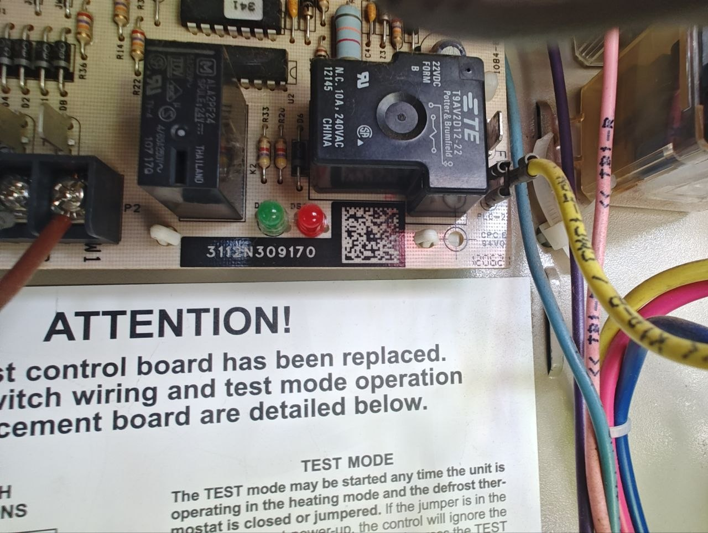
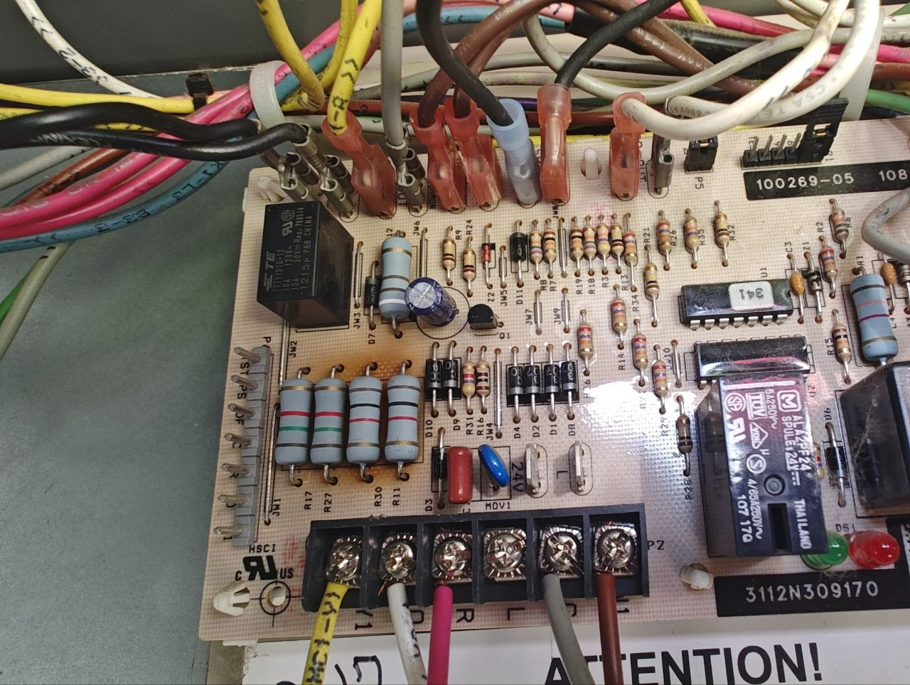
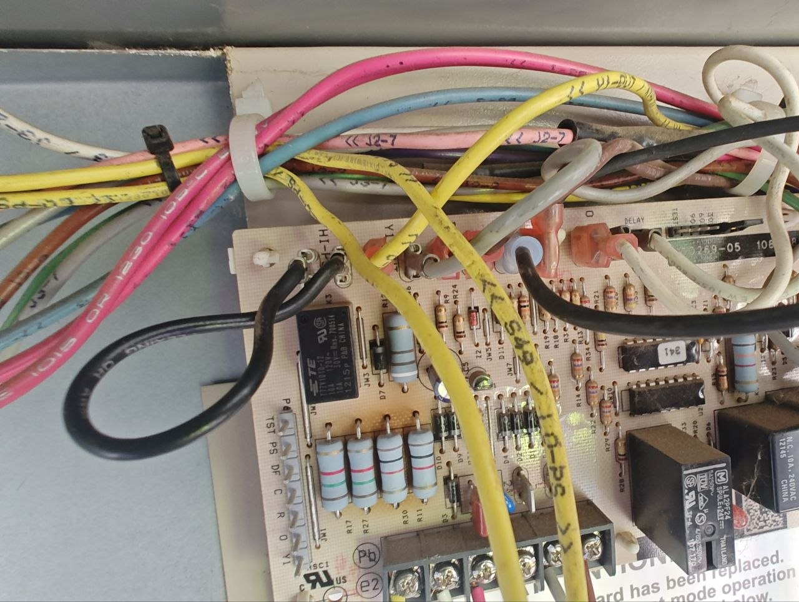
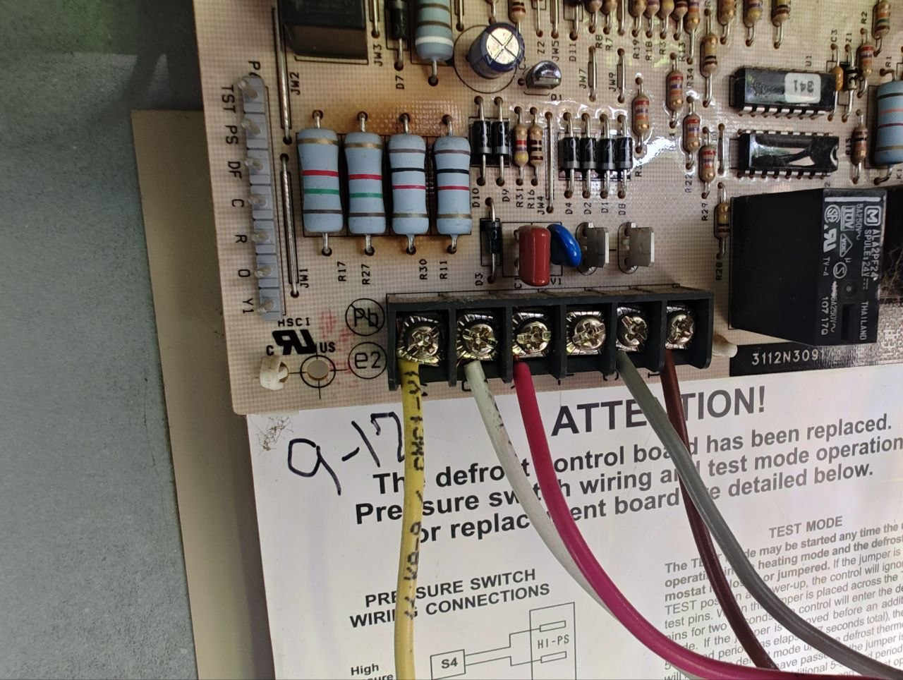

# 240 V on a 24 V defrost board

**23 June 2025.** Packaged rooftop heat pump, Lennox / Allied family. Outdoor defrost control Honeywell 100269-05 (kit 84W88). Cabinet model unknown. Site and customer not named.

## Call

The unit had just had a contactor swapped, probably on a routine inspection. A compressor swap happened around the same job. I am fuzzy on whether that was before or after this chase. Soon after, the unit was down. The defrost board was fried. Another tech swapped the board and called it good. It went down again. I got the callback.

## What I saw

The burn was obvious. I still have both dead boards. Brown scorch sits on the Class-2 side, around the 24 V resistors (R17, R27, R30, R11), not on the 240 V fan relays.

This board puts 24 VAC control and 240 VAC fan switching on the same PCB. P2 is the 24 V field strip. Line voltage from the heat strips does not belong there.

Both diagnostic LEDs were on. On this 100269-05 revision that pattern is not in the kit table. I logged it and kept metering.

## Chase

I started taking voltages and found 240 V on the 24 V side of the board. That explains a lot.

I got stuck and called OEM support. They emailed the wiring diagram and left me to keep tracing. The mix was at the auxiliary heater: 24 V control tied into 240 V line. On a heat-pump rooftop, defrost is supposed to call the strips with 24 V on W1. A sequencer then switches line voltage to the elements. Line from the strips should never land on P2 / P6.

The prior swap was described as wire for wire. That can be true and still kill the next board. If the landing is wrong, copying the landing copies the fault.

## Fix

New contactor. New board. Wired to the print. It ran.

## What I am not claiming

This is a field postmortem, not a software project. I am not publishing the customer's print. Hours are unlogged, so they are not on this page. I do not have a cabinet SKU and I am not guessing one.

## Photos

Live diagnostics, 19 Aug 2026 drop of the 23 June 2025 job. Copies. No site, customer, or coworker in frame.

DS2 green and DS1 red both lit. TE Potter & Brumfield fan relay rated N.C. 10 A / 240 VAC. Serial sticker 3112N309170. Kit sheet already on the panel.

Silkscreen 100269-05. Scorch at the 24 V resistor cluster. P2 field strip at the bottom. Factory 1/4" quick-connects along the top.

Pink factory leads marked J2-7. Yellow marked S4 / HI-PS. P6 header: TST PS DF C R O Y1.

P2 landings: yellow, white, pink, grey, brown. Handwritten 9-17 on the replacement sticker. This board was already a service replacement.
