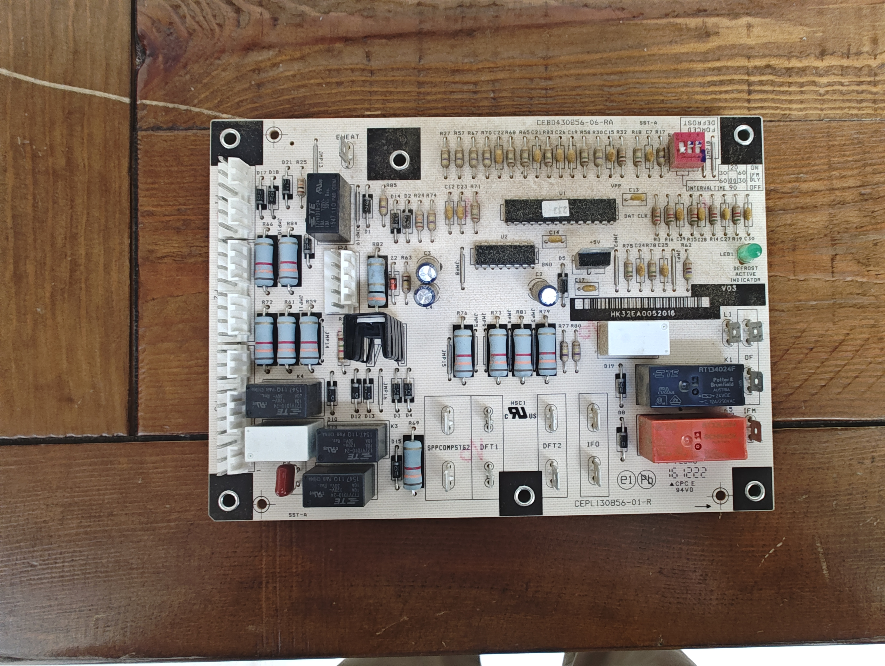
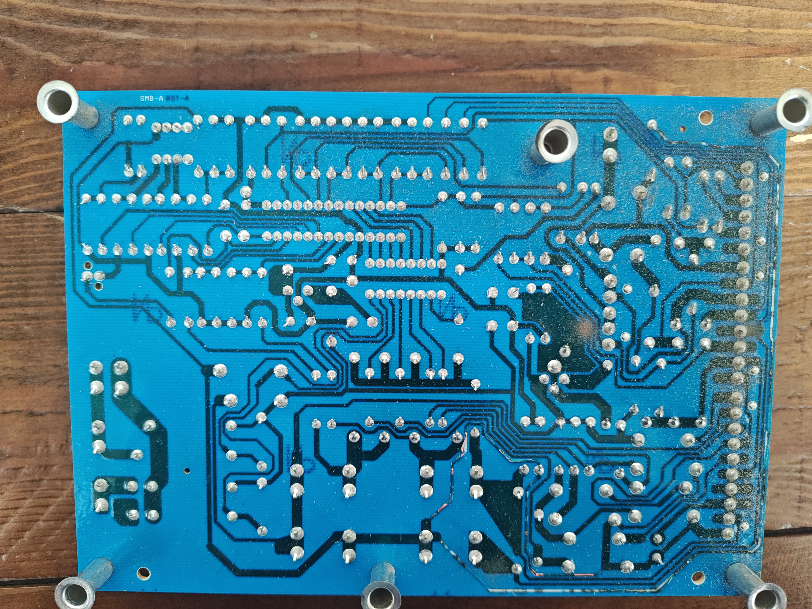
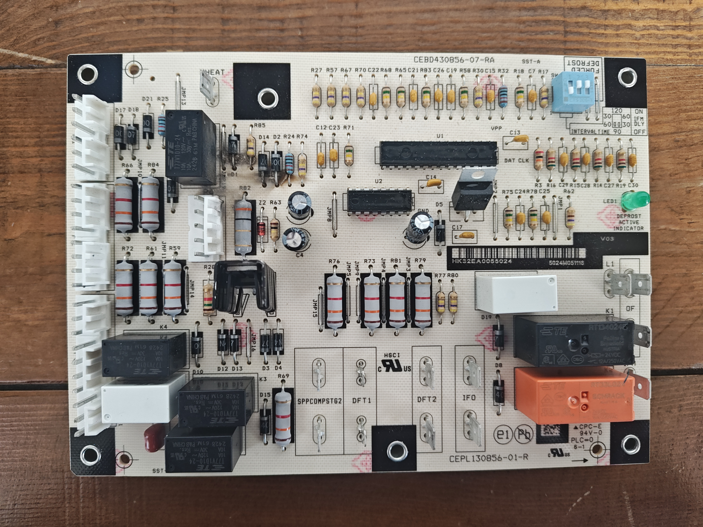
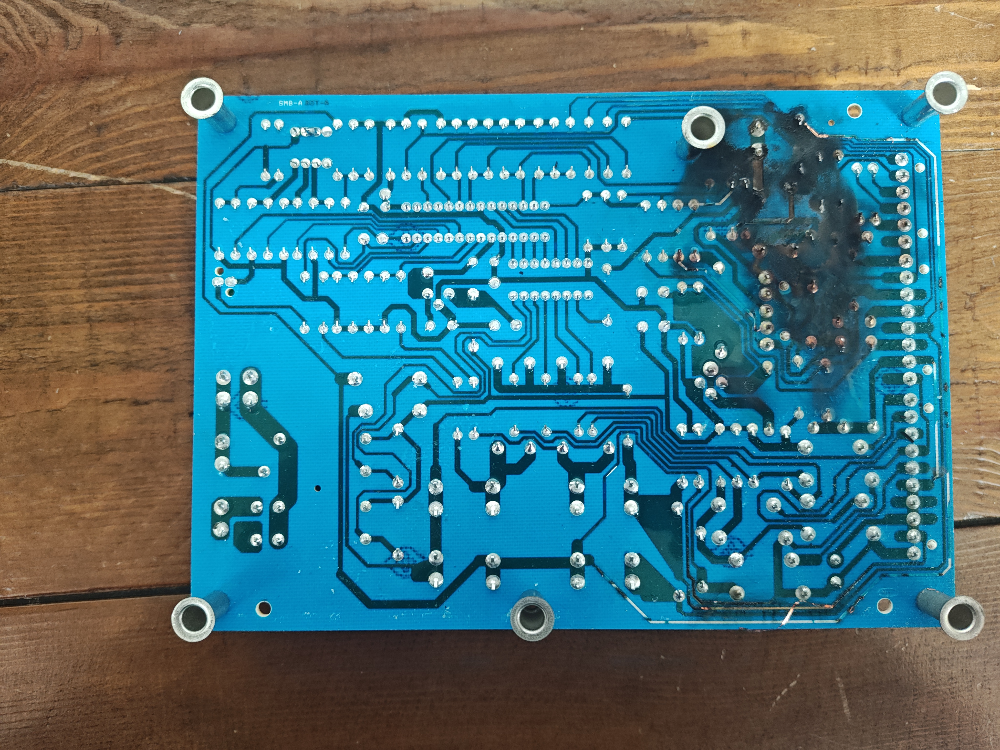
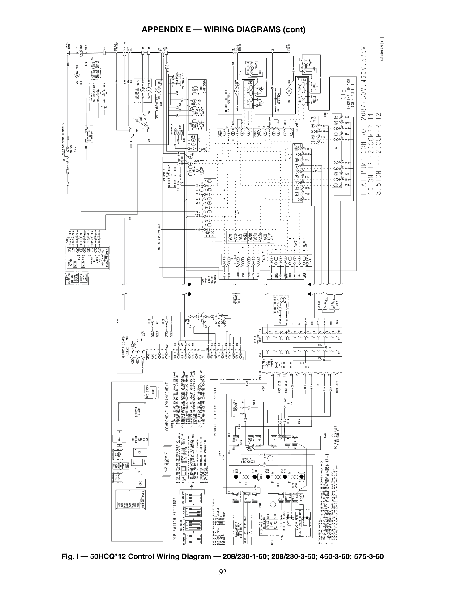
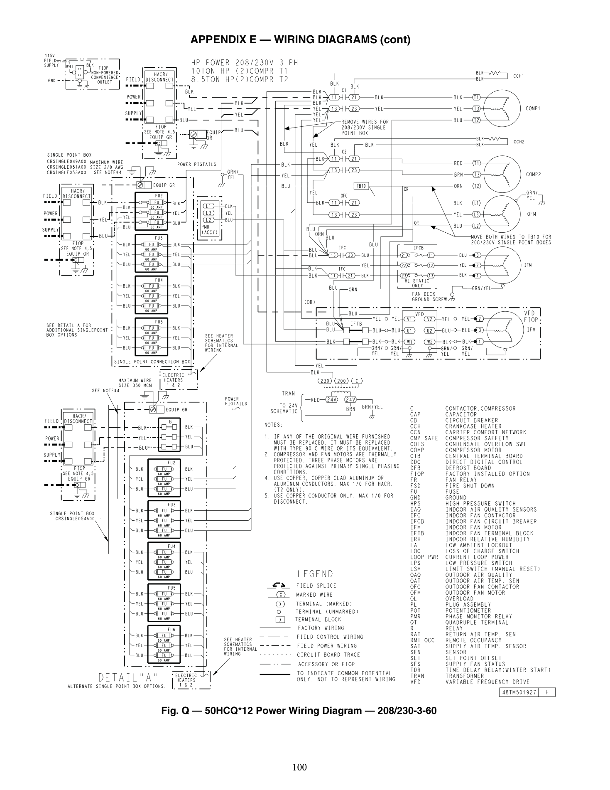

# 240 V on a 24 V defrost board

**23 June 2025.** ATI plant, Millersburg, Oregon. Carrier packaged rooftop heat pump. Defrost control **HK32EA005** (CEPL130856-01-R). **10.5 hours** logged on this fix.

I looked for a data plate and did not find one due to files and photos being on a work phone. The board silk is two-stage (`SPPCOMPSTG2`, `DFT1` / `DFT2`). Return filters were 16x24 or 18x24, not a 5-divisible size, pulled from a hood on the side of the cabinet. On this board family that combination lines up with Carrier 50HCQ size 12. I am calling it size 12 from the filters and the silk. I do not have a plate to confirm it, unfortunately.

## Call

The unit had recently had a contactor swapped, probably on a routine inspection. We also had to replace the compressor, though I am fuzzy on whether that happened before or after this chase. The unit went down soon after, and the defrost board had fried. Other techs swapped the board and called it good- but the unit went down again, the customer called us back, and this time I got sent.

## What I saw

I actually kept both boards and still have them, because this was a meaningful development for me- it's when wiring diagrams really started making sense to me.

The older board is CEBD430856-06-RA, barcode HK32EA0052016. It is aged, and there is no burn-through on the back.

The newer board is CEBD430856-07-RA, barcode HK32EA0055024. The face is cleaner and less aged, and it is obviously scorched. Carbon goes through the back at the OF / L1 / fan-relay pins.

This board puts 24 V control and line-voltage fan switching on the same PCB. Electric heat is on the same board at `EHEAT`. Line from the heat strips does not belong on the 24 V side.

## Chase

I could see the burnt damage, so I started taking voltages and found 240 V right on the 24 V side of the board, which explained a lot.

I got stuck and called OEM support. They emailed the wiring diagram and left me to keep tracing. That copy lived on a work phone I no longer have. The public sheets below are the same size-12 control and power ladders from Carrier's service book, the same print I used on the roof. Over time I traced the mix to the auxiliary heater: 24 V control tied into 240 V line. Defrost is supposed to call the strips with 24 V, and a sequencer then switches line voltage to the elements. Line from the strips should never land on the Class-2 terminals.

The prior swap was described as wire for wire, which could be true and still kill the next board if the landing itself is wrong.

## Fix

We got a new contactor, got a new board, wired it to the print, and everything ran like I expected. 10.5 hours on the job.

## Notes

Street address, account number, and the other tech's name stay off this page. I do not have a stamped cabinet SKU. The two ladder sheets are from Carrier 50HCQ-4-12-02SM, Appendix E, Fig. I and Fig. Q, because the emailed job copy lived on a work phone I no longer have.

## Photos

Both failed boards, photographed on the bench on 24 Aug 2026.

Older board, front: CEBD430856-06-RA, barcode HK32EA0052016. Silk includes EHEAT, DFT1/DFT2, and INTERVAL TIME 30/60/90.

The back of the older board has no burn-through.

Newer board, front: CEBD430856-07-RA, barcode HK32EA0055024. Less aged than the original.

The back of the newer board has scorch through the solder mask at the fan-relay / OF / L1 corner.

## Print

These are the two sheets I sat with: the size-12 control ladder and the 208/230-3 power ladder.

Fig. I. 50HCQ*12 control. Two compressors. Defrost board on the left, CTB on the right. Source: Carrier 50HCQ-4-12-02SM p.92.

Fig. Q. 50HCQ*12 power, 208/230-3-60. Source: same book, p.100.
